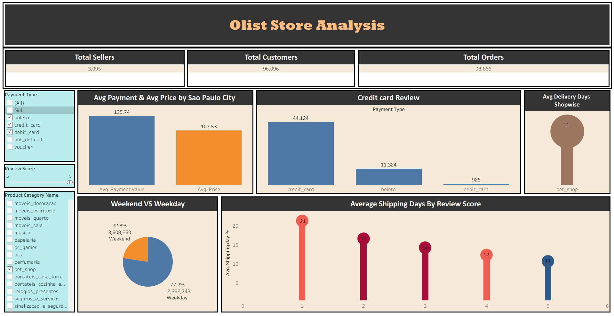
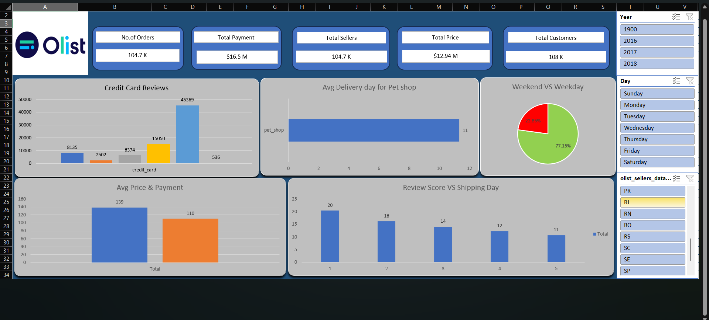

# E-Commerce Sales & Customer Analytics

## 📌 Problem Statement
Analyze e-commerce data to understand sales performance, customer behavior, and product trends to support business decision-making.

---

## 🛠 Tools Used
- SQL (MySQL)
- Excel
- Tableau
  
---

## 📊 Analysis Performed
- Data extraction and transformation using SQL
- Data preparation and validation in Excel
- Interactive dashboard creation in Tableau

---

## 📈 Key Insights
- Identified top-selling products and categories
- Analyzed customer purchase patterns
- Observed revenue trends over time

---

## 📊 Dashboard Preview

## 📊 Excel Dashboard

The Excel dashboard file is large and not included in this repository.

🔗 [View / Download Excel Dashboard](https://drive.google.com/drive/folders/1ASKjXY0aIhwxG9EmBKke98l8hK7st_QT?usp=drive_link)

--

## 📂 Project Structure

scripts/ → SQL queries  
reports/ → Tableau dashboard and Excel analysis  
dashboards/ → dashboard screenshots  

---

## 👤 Author
Sanjay Reddy Challa
